<!-- _class: lead dark -->
<!-- _paginate: false -->

O'Reilly Live Training

# Vibe Coding for Problem Solvers

## Solving your own small problems with little apps

Lucas Soares · Automata Learning Lab

---

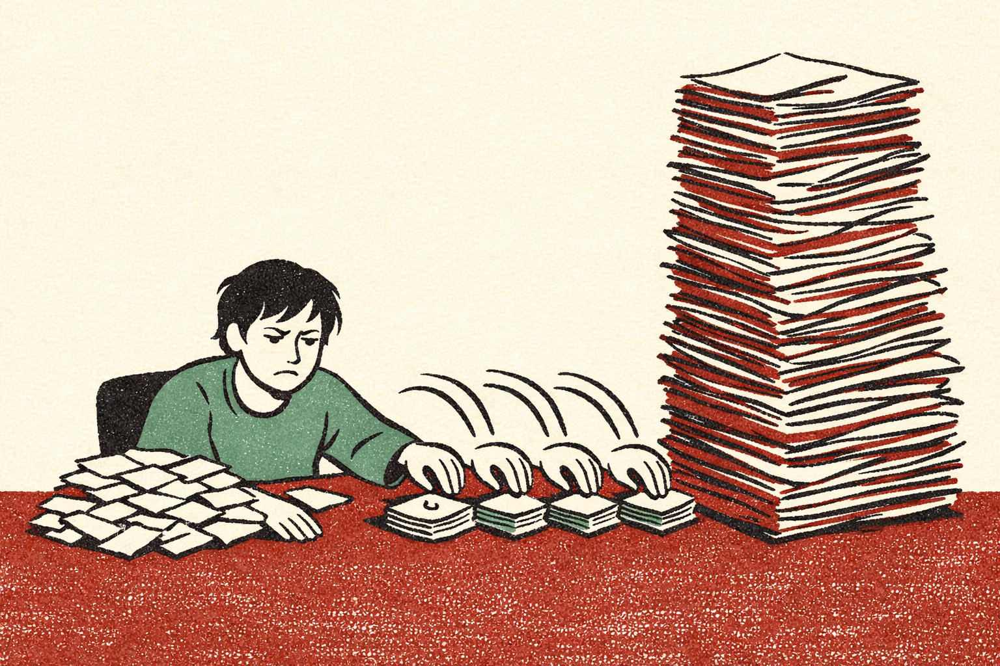

Start here

## There's something you keep doing by hand.

Clicking through a folder one file at a time. Retyping the same thing into a spreadsheet.

You've done it so often you stopped noticing it.

---

<!-- _class: lead -->

The framework · use it on everything today

# Notice → Ask → Look → Keep or kill

<h3>1 · Notice</h3>
The motion you repeat

→

<h3>2 · Ask</h3>
One plain sentence

→

<h3>3 · Look</h3>
Open it, don't read it

→

<h3>4 · Keep or kill</h3>
Most get killed

Six stories. Every one is a turn of this loop.

---

<!-- _class: lead dark -->

Story 1 · the ask

# One sentence was enough

---

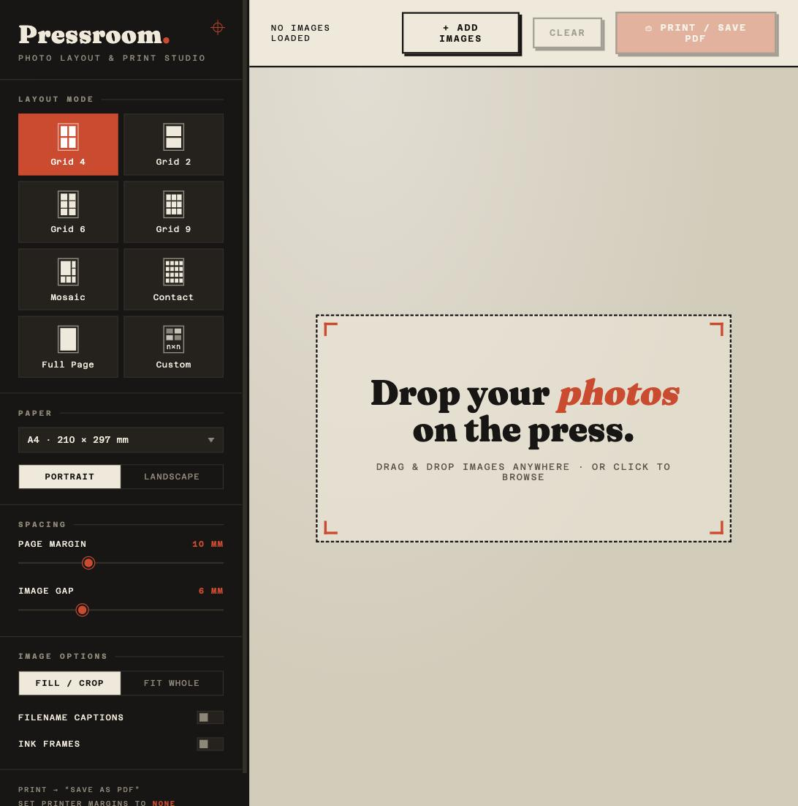

## I wanted photos printed four to a page.

Build me a simple html app that I can use to upload a bunch of images and it will provide layouts for printing them into a pdf in grid mode or other modes

That prompt. First try. The browser's print dialog makes the PDF, so there's no library and nothing to install.

<strong>Lesson:</strong> plain sentence first, clever later.

---

<!-- _class: lead dark -->

Story 2 · keep

# The one I still use

---

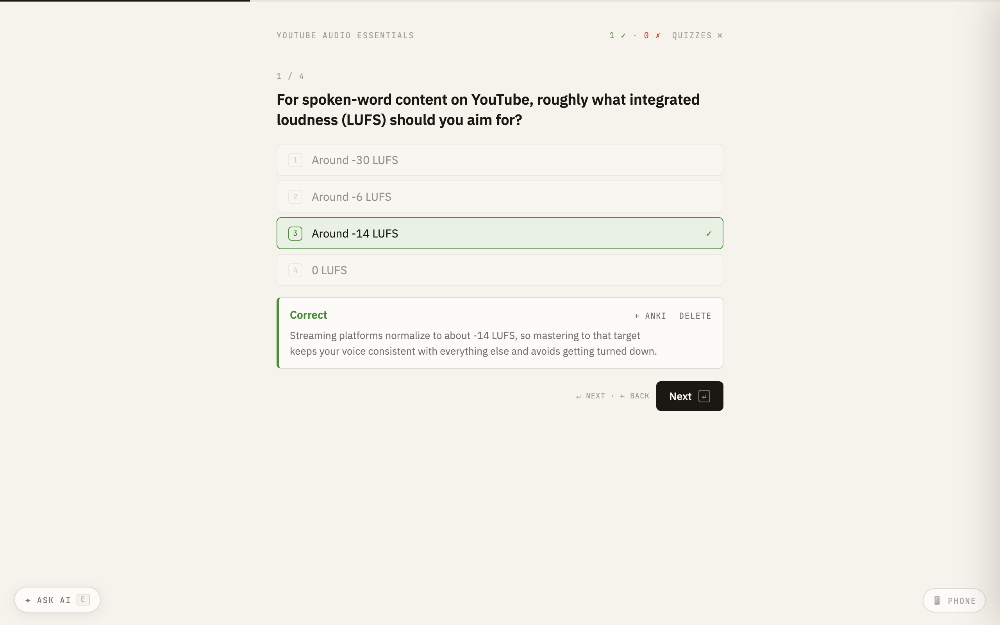

## I read things and forget them.

Asked for a quiz: give it a document, answer from the keyboard, get graded.

Seventeen months later it's still open. Twenty-five quizzes in the folder. Keyboard shortcuts, because clicking got annoying. A button that pushes what I got wrong into Anki.

<strong>Lesson:</strong> the keepers announce themselves. You don't decide up front.

---

<!-- _class: lead dark -->

Story 3 · the second tool

# I built the same thing twice

---

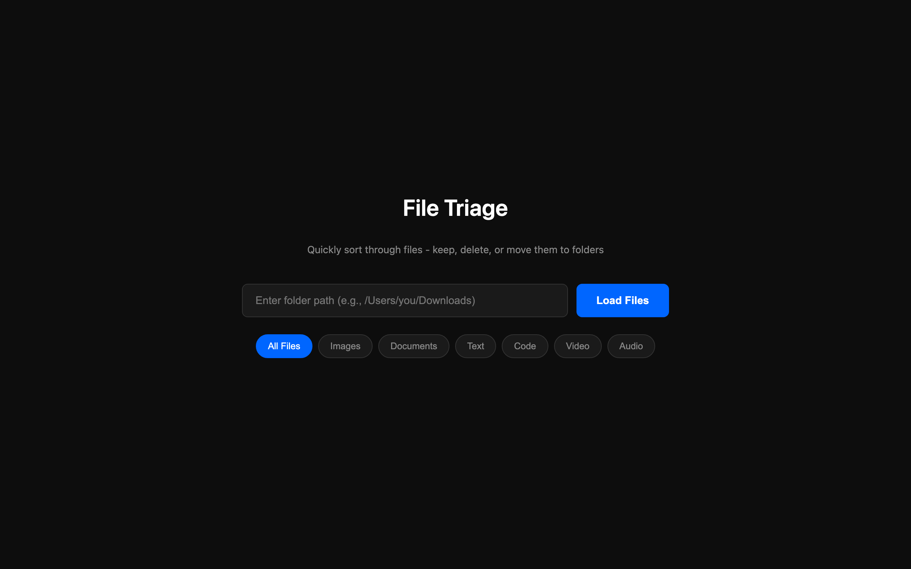

## First: a folder of images, keep or bin.

One sitting. Full-screen photo, arrow keys to decide, one confirm at the end. Nothing deletes until you say so.

**Five weeks later** I hit the same wall with a folder of mixed PDFs, notes and CSVs.

I didn't go back to Finder. I built the harder version that renders every file type inline.

<strong>Lesson:</strong> your second tool is usually your first one, generalised.

---

<!-- _class: lead dark -->

Story 4 · notice

# Pausing the video to type the time

---

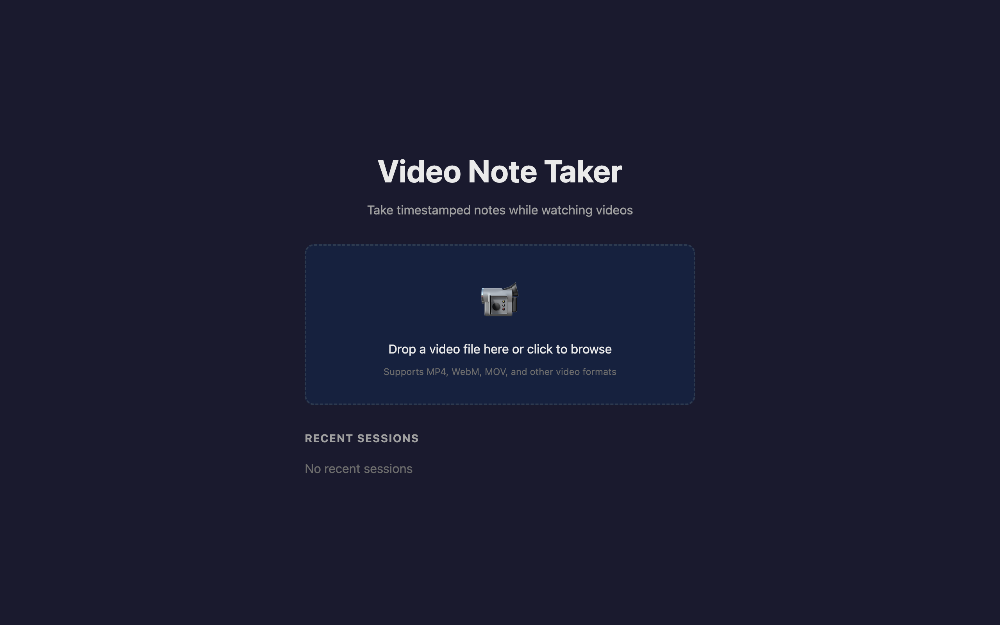

## Watch, type a note, keep the timestamp.

By hand this is: pause, read the clock, type `14:32 —`, unpause. Every single note.

Now I type while it plays and click a note later to jump back to that second.

<strong>Lesson:</strong> the best candidates are motions so small you'd never file a ticket for them.

---

<!-- _class: lead dark -->

Story 5 · throw it away

# A plan three other people needed

---

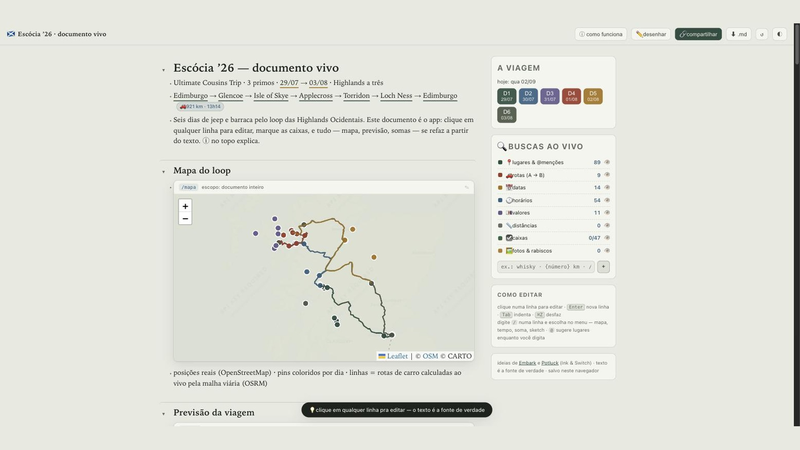

---

## The text is the source of truth.

Type plain text. The map draws itself, the forecast fills in for those dates, drive times come from real roads, costs add up.

Edit a line, everything recomputes.

No API key. Free public services for maps, weather, routing and currency.

I wrote my cousins a one-page guide in Portuguese so they could edit it too.

<strong>Lesson:</strong> a document that computes beats one you keep updating by hand.

---

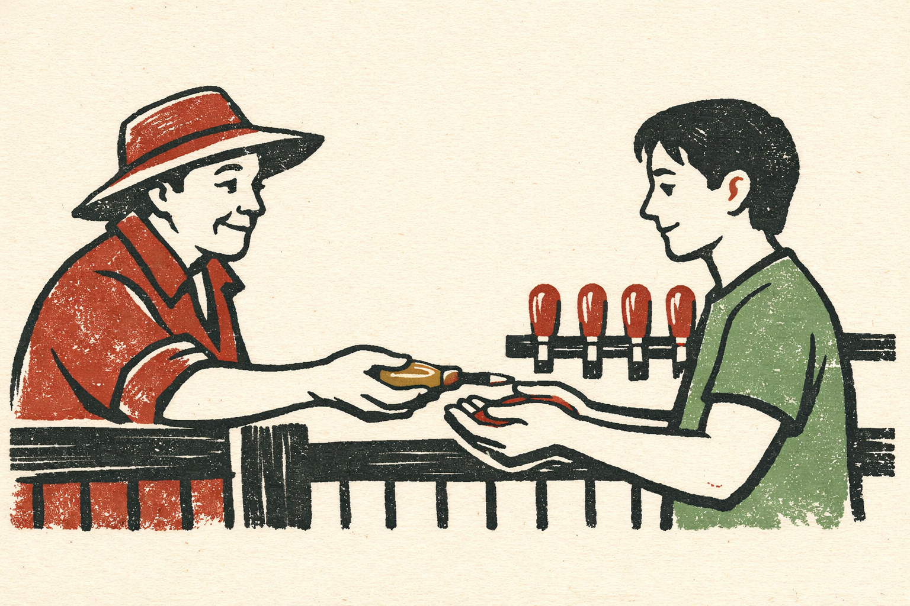

## Two weeks earlier, this was Iceland.

Same dates, same three people, a fully researched Iceland dossier.

Then the trip changed. I didn't edit it — I rebuilt it for Scotland, because rebuilding took an afternoon.

<strong>Lesson:</strong> cheap to make means cheap to throw away.

---

<!-- _class: lead dark -->

Story 6 · the deep end

# I ran a whole tournament on one

---

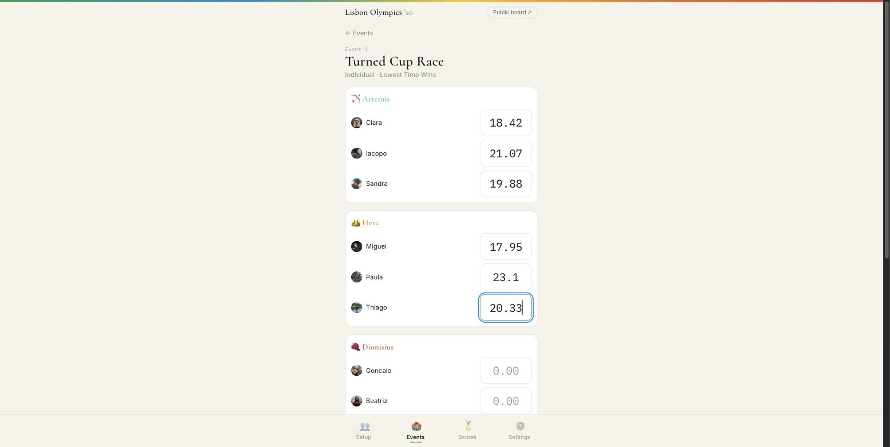

## Four teams. Seven events. A field with no wifi.

This is the entire organiser interface during an event.

**One number per person. That's it.**

Brackets, seeding, medals and running totals all come out of these boxes.

---

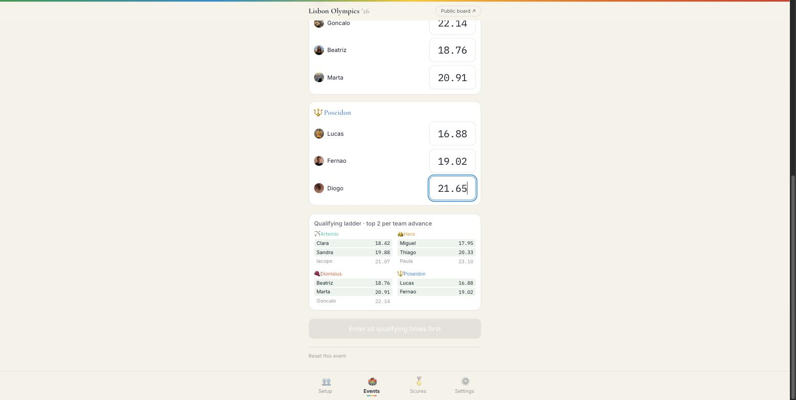

## Type the times, the ladder seeds itself.

Top two per team advance, highlighted as you type. Nobody argues about who qualified, because nobody worked it out.

The bracket maths has real tests behind it — the one place in the whole collection where I wrote them.

---

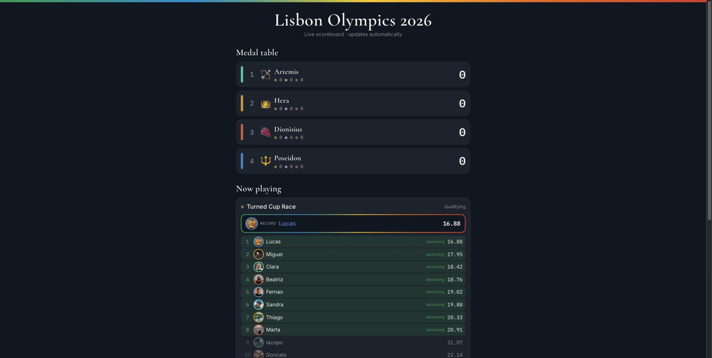

## Everyone else watched this on their phone.

A public scoreboard on the same local network, reached by scanning a QR code. It updates itself.

Records highlight automatically as they're broken.

---

<!-- _class: quote -->

> You don't know what to automate until you've watched yourself fail at doing too much of it.

The first version tried to run everything through a database of tasks. I threw it away and kept one screen.

---

## This one is the deep end. You arrive here.

### What it took
* Two days, not two hours
* A framework and a hosted database
* Tests for the bracket maths

### What stayed the same
* One annoying job done by hand
* Smallest thing that removed it
* First attempt thrown away

Teams, shirts, who brings the speaker — all still human. <strong>Lesson:</strong> automate the bottleneck, not the event.

---

<!-- _class: lead dark -->

The framework, up close

# Now you do it

---

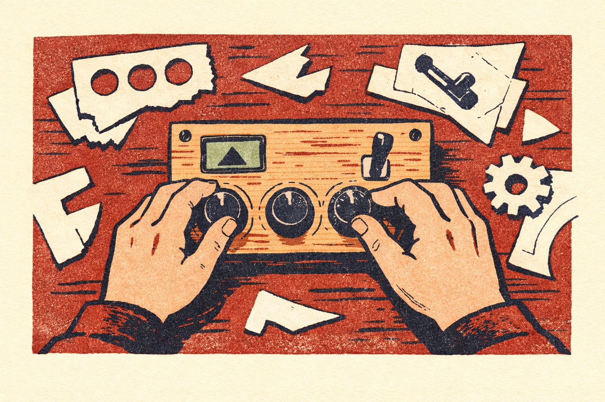

## 1 · Notice the motion

It's never "I should build an app." It's irritation. Mine, verbatim:

without having to click them one by one

So I don't have to go looking for the file

so I never have to go there

---

## 2 · Ask in one plain sentence

### Say
* What goes in
* What you want to see
* What comes out at the end

### Don't say
* Which library to use
* How to structure the code
* Anything you'd have to look up

If one sentence gets you nothing, the sentence was vague. Not the model.

---

## What can you even ask for?

<h3>Transformer</h3>
Paste in, get out

<h3>Tuner</h3>
Sliders, live preview

<h3>Triage deck</h3>
One at a time, decide

<h3>Viewer</h3>
Your data, your layout

<h3>Annotator</h3>
Mark it up, export marks

<h3>Visualiser</h3>
Numbers to a picture

Six shapes cover most of it. Pick the shape, then describe your version of it.

---

## 3 · Open it and look

I don't read the code. I open the thing and use it.

When it's wrong I screenshot it and paste that back with a few words.

108

of my prompts in seven weeks were a pasted screenshot

You already know what wrong looks like. That's the whole qualification.

---

## Saying what's wrong, without the vocabulary

Point at it in plain words.

*"The buttons are too far apart."*
*"When I press enter nothing happens."*
*"Make the list fill the width."*

Three words for what a page is made of:

* **HTML** — what's on the page
* **CSS** — how it looks
* **JavaScript** — what happens when you click

That's the entire technical prerequisite for today.

---

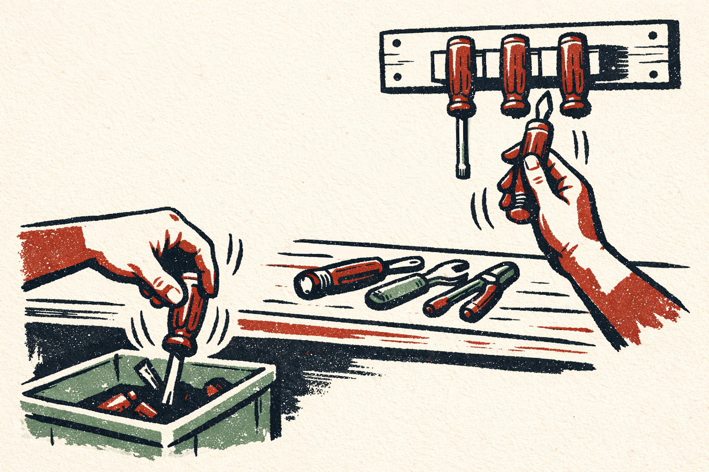

## 4 · Keep it or kill it

**Keep** — you reached for it twice · it removed a motion you actually repeat · it runs with nothing installed

**Kill** — you had to talk yourself into using it · it needs babysitting · you've stopped opening it

Rebuilt the same thing three times? That's the signal to make it permanent.

---

## Killing is the normal ending

kill this app and delete it

just kill the app for now is a bit trash

kill the app, remove the code, i'm not using this

The first one was killed four hours before the version that worked. Same idea, simpler build.

---

## Before you trust it with anything real

**Poke it**
* Add an item with a very long name
* Can you edit, not just add and delete?
* Reload. Is your data still there?

**Check where things go**
* Does it talk to the internet? To whom?
* Never paste a real key into something you'll share
* Test with fake data first

Press <strong>F12</strong> for errors. Copy the red text, paste it back, carry on.

---

## Enough vs. stop and think

### A quick look is enough
* Yours, and it runs locally
* A throwaway
* Nobody else opens it

### Slow down
* Anything public
* Other people's data
* Anything you'd hate to leak

---

<!-- _class: lead -->

Now you

# Give me something you do by hand.

We'll build it here, together, in about fifteen minutes.

No external accounts, no logins. Something you did this week.

---

<!-- _class: lead dark -->
<!-- _paginate: false -->

Take this with you

# Notice → Ask → Look → Keep or kill

Name the motion you repeat. Ask in one sentence. Open it and look. Keep it only if you reach for it twice.

<a href="https://github.com/EnkrateiaLucca/vibe-coding-problem-solvers">Course materials — GitHub</a> 
<a href="https://www.youtube.com/@automatalearninglab">YouTube — @automatalearninglab</a>

